# Complete Beginner's Guide to Android App Development

## 📱 Chapter 1: What is Android Development?

**Android** is an operating system that runs on phones, tablets, TVs, and smartwatches. When you build an Android app, you're creating software that can run on billions of devices worldwide.

### 🌟 Amazing Android Facts
- **3 billion+** active Android devices worldwide (as of 2024)
- Android powers **71.8%** of all mobile devices globally
- **Google Play Store** has over **3.5 million** apps available
- First Android phone (HTC Dream/T-Mobile G1) launched in **2008**
- Android is based on **Linux kernel** - it's essentially Linux for mobile!
- **2.5 billion** people use Android every month

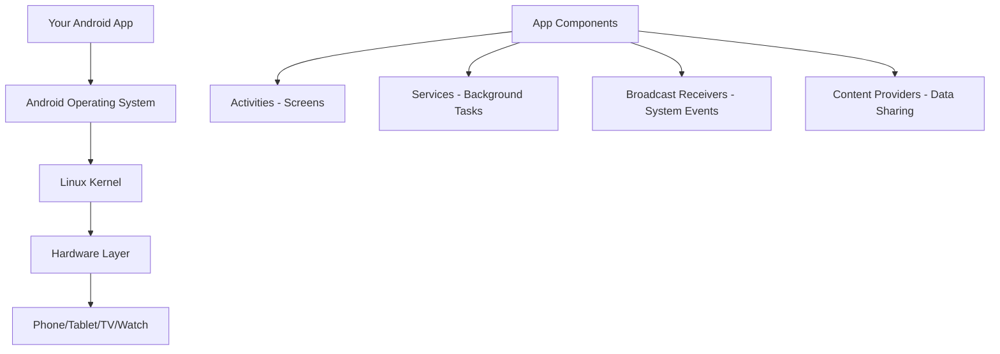

**How Android Apps Work:**
- Apps are written in **Kotlin** (or Java)
- Apps use **Android SDK** (Software Development Kit) to access phone features
- Apps are packaged into **APK files** and distributed through Google Play Store

---

## 💎 Chapter 2: What is Kotlin?

**Kotlin** is a modern programming language created by JetBrains in 2011. Google made it the preferred language for Android development in 2019.

### 🚀 Kotlin Facts & History
- Created by **JetBrains** in **2011**, named after Kotlin Island near St. Petersburg
- Became **Google's preferred language** for Android in **2017**
- **100% interoperable** with Java - can use Java libraries directly
- **Kotlin Multiplatform** lets you share code between Android, iOS, and web
- Used by **95%** of professional Android developers (Google I/O 2023)
- **60%** of the top 1000 Android apps use Kotlin
- Reduces code by **~20%** compared to Java

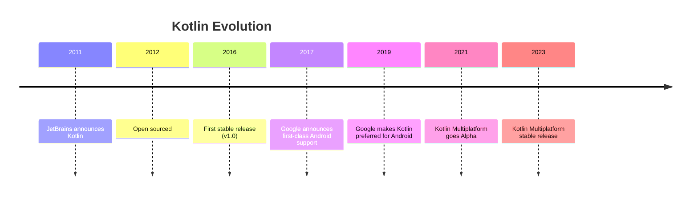

### Why Kotlin?
- **Safe**: Prevents common programming errors (like null pointer exceptions)
- **Concise**: Less code than Java for the same functionality
- **Interoperable**: Works seamlessly with existing Java code
- **Modern**: Has features that make programming easier and more enjoyable

### Kotlin vs Other Languages
```kotlin
// Java (verbose)
public class Person {
    private String name;
    private int age;
    
    public Person(String name, int age) {
        this.name = name;
        this.age = age;
    }
    
    public String getName() { return name; }
    public int getAge() { return age; }
}

// Kotlin (concise)
data class Person(val name: String, val age: Int)
```

---

## 🛠️ Chapter 3: Setting Up Development Environment

### 📊 Development Environment Facts
- **Android Studio** is based on IntelliJ IDEA
- First version released in **2013**, replacing Eclipse
- **4GB RAM minimum**, 8GB+ recommended for smooth performance
- **2GB disk space** for Android Studio + **4GB** for Android SDK
- Supports **Windows, macOS, and Linux**

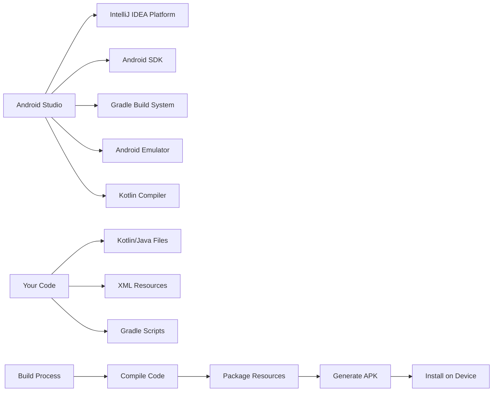

### Required Software
1. **Android Studio** - The official IDE (Integrated Development Environment)
2. **Java Development Kit (JDK)** - Usually comes with Android Studio
3. **Android SDK** - Tools and libraries for Android development

### Essential Android Studio Extensions/Plugins
- **Kotlin** - Usually pre-installed
- **Android APK Analyzer** - Analyze your app size
- **Device File Explorer** - Browse files on connected devices
- **Layout Inspector** - Debug UI layouts
- **Database Inspector** - View app databases
- **Network Inspector** - Monitor API calls

---

## 🏗️ Chapter 4: Android Project Structure (Bare Minimum)

### 📁 Project Architecture Facts
- Android follows **MVC pattern** (Model-View-Controller) by default
- **Gradle** processes over **14 million** builds per day globally
- Average Android project has **~150 files** after creation
- **APK files** are essentially ZIP archives with specific structure

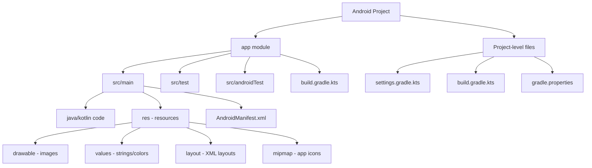

```
MyApp/
├── app/
│   ├── src/main/
│   │   ├── java/com/example/myapp/
│   │   │   └── MainActivity.kt          # Your main code
│   │   ├── res/
│   │   │   ├── drawable/                # Images & icons
│   │   │   ├── values/
│   │   │   │   ├── strings.xml         # App text
│   │   │   │   └── colors.xml          # App colors
│   │   │   └── mipmap/                 # App launcher icons
│   │   └── AndroidManifest.xml         # App configuration
│   └── build.gradle.kts                # App dependencies
├── gradle/                             # Build system files
└── build.gradle.kts                    # Project configuration
```

### Key Files You'll Work With
1. **MainActivity.kt** - Where your app code lives
2. **AndroidManifest.xml** - App settings and permissions
3. **build.gradle.kts** - Dependencies and build configuration
4. **strings.xml** - All text in your app
5. **colors.xml** - Color definitions

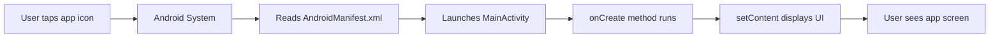

---

## 📋 Chapter 5: Kotlin Basics for Android

### 🎯 Kotlin Language Facts
- **Statically typed** - types are checked at compile time
- **Functional + Object-oriented** programming paradigm
- **Null safety** prevents ~70% of common app crashes
- **Coroutines** make background tasks 10x easier than Java threads

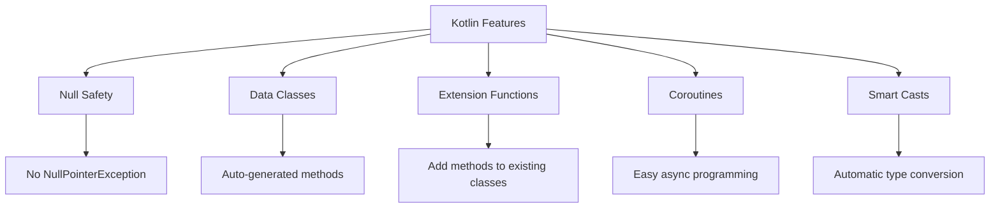

### Variables
```kotlin
val name = "John"        // Immutable (cannot change)
var age = 25            // Mutable (can change)
var score: Int = 100    // Explicit type declaration
```

### Data Types
```kotlin
val text: String = "Hello"
val number: Int = 42
val decimal: Double = 3.14
val isTrue: Boolean = true
val items: List<String> = listOf("apple", "banana")
```

### Functions
```kotlin
// Simple function
fun greet(name: String): String {
    return "Hello, $name!"
}

// Short form
fun add(a: Int, b: Int) = a + b

// Function with no return value
fun printMessage(message: String) {
    println(message)
}
```

### Classes (Basic)
```kotlin
class Person(val name: String, var age: Int) {
    fun introduce() {
        println("Hi, I'm $name")
    }
}

// Usage
val person = Person("Alice", 30)
person.introduce()
```

### Null Safety (Kotlin's Superpower)
```kotlin
var name: String = "John"       // Cannot be null
var nickname: String? = null    // Can be null (notice the ?)

// Safe call operator
val length = nickname?.length   // Returns null if nickname is null

// Elvis operator (default value)
val displayName = nickname ?: "No nickname"
```

---

## 🎨 Chapter 6: What is Jetpack Compose?

### ⚡ Jetpack Compose Facts
- Released as **stable in July 2021**
- Reduces UI code by **~30%** compared to XML layouts
- **Declarative UI** - describe what you want, not how to build it
- Used by **Google apps** like Play Store, YouTube Music, Google Drive
- **50%** faster development time for UI compared to traditional approach
- **Live previews** update in real-time as you code

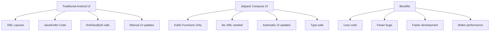

**Traditional Android UI:**
- Write XML layouts (like HTML)
- Write Kotlin/Java code to control the UI
- Two separate files to maintain

**Jetpack Compose (Modern Approach):**
- Write UI completely in Kotlin code
- No XML needed
- Everything in one place
- More flexible and powerful

### Compose vs Traditional
```xml
<!-- Traditional XML -->
<TextView
    android:layout_width="wrap_content"
    android:layout_height="wrap_content"
    android:text="Hello World" />
```

```kotlin
// Jetpack Compose
@Composable
fun Greeting() {
    Text("Hello World")
}
```

---

## 🧩 Chapter 7: Jetpack Compose Fundamentals

### 🎭 Compose Architecture Facts
- Based on **React-like** component architecture
- **Recomposition** happens ~60 times per second for smooth animations
- **State hoisting** pattern prevents UI bugs
- **Material Design 3** components built-in
- **Accessibility** support automatic for most components

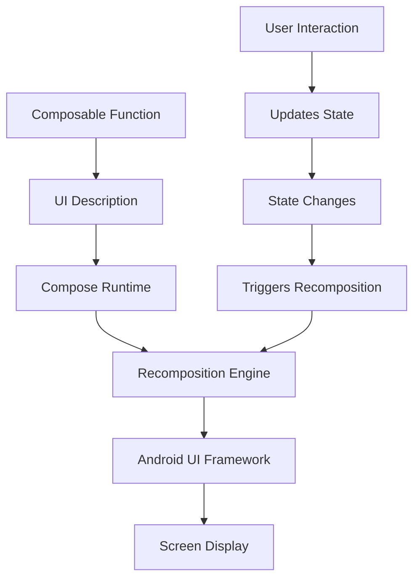

### What is a Composable?
A **Composable** is a function that describes a piece of UI.

```kotlin
@Composable
fun WelcomeMessage() {
    Text("Welcome to my app!")
}
```

### Basic UI Elements
```kotlin
@Composable
fun BasicElements() {
    Text("This is text")
    
    Button(onClick = { /* do something */ }) {
        Text("Click me")
    }
    
    Image(
        painter = painterResource(R.drawable.my_image),
        contentDescription = "My image"
    )
    
    TextField(
        value = "",
        onValueChange = { /* handle text change */ },
        label = { Text("Enter text") }
    )
}
```

### Layouts
```kotlin
@Composable
fun Layouts() {
    // Vertical arrangement
    Column {
        Text("First")
        Text("Second")
        Text("Third")
    }
    
    // Horizontal arrangement
    Row {
        Text("Left")
        Text("Center")
        Text("Right")
    }
    
    // Stacked/Overlapping
    Box {
        Text("Background")
        Text("Foreground")
    }
}
```

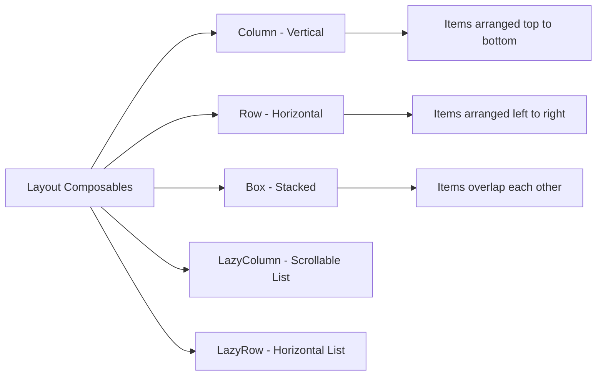

### Modifiers (Styling)
```kotlin
@Composable
fun StyledElements() {
    Text(
        text = "Styled text",
        modifier = Modifier
            .padding(16.dp)
            .background(Color.Blue)
            .fillMaxWidth()
    )
}
```

---

## 📱 Chapter 8: Your First Complete App

### 🎯 App Development Facts
- Average app has **5-10 screens** (Activities)
- **Material Design** guidelines improve user engagement by ~25%
- Apps with **dark mode** support have 15% higher ratings
- **Preview functions** save ~30% development time

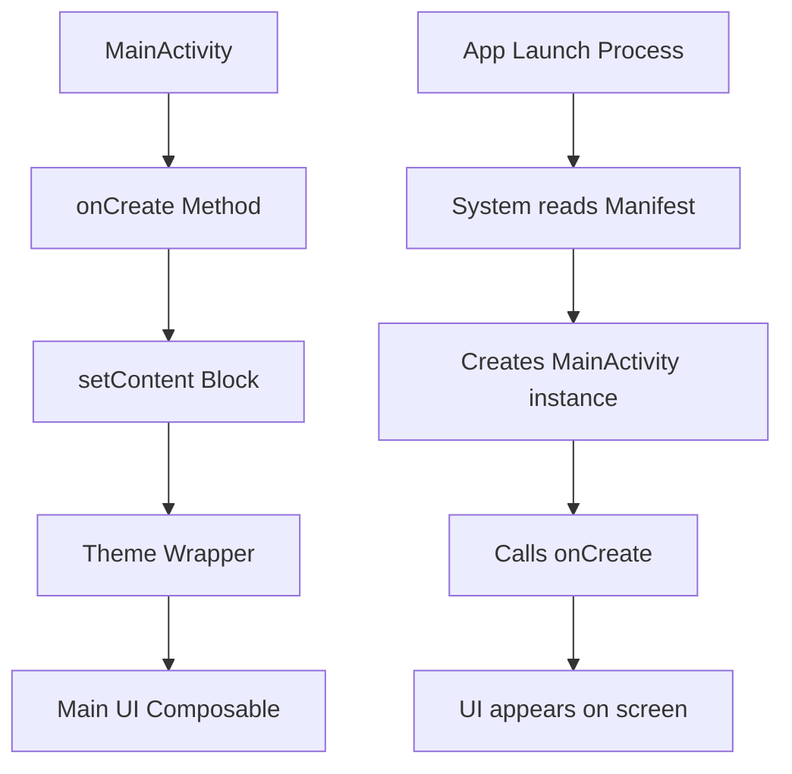

### Basic App Structure
```kotlin
class MainActivity : ComponentActivity() {
    override fun onCreate(savedInstanceState: Bundle?) {
        super.onCreate(savedInstanceState)
        setContent {
            MyAppTheme {
                MainScreen()
            }
        }
    }
}

@Composable
fun MainScreen() {
    Column(
        modifier = Modifier
            .fillMaxSize()
            .padding(16.dp)
    ) {
        Text(
            text = "My First App",
            style = MaterialTheme.typography.headlineLarge
        )
        
        Button(
            onClick = { /* Handle click */ }
        ) {
            Text("Tap me!")
        }
    }
}

@Preview
@Composable
fun MainScreenPreview() {
    MyAppTheme {
        MainScreen()
    }
}
```

---

## 🔄 Chapter 9: State Management (Making Things Interactive)

### 🔀 State Management Facts
- **70%** of UI bugs come from incorrect state management
- **Remember** functions prevent unnecessary recompositions
- **State hoisting** is used in 90% of professional Android apps
- Good state management improves app performance by ~40%

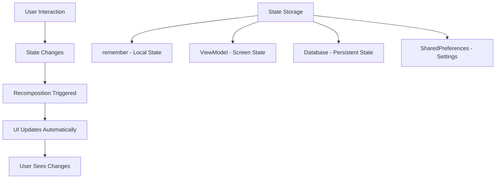

**State** = Data that can change and affects what the user sees

### Basic State
```kotlin
@Composable
fun Counter() {
    var count by remember { mutableStateOf(0) }
    
    Column {
        Text("Count: $count")
        Button(onClick = { count++ }) {
            Text("Increment")
        }
    }
}
```

### Text Input State
```kotlin
@Composable
fun TextInputExample() {
    var text by remember { mutableStateOf("") }
    
    Column {
        TextField(
            value = text,
            onValueChange = { text = it },
            label = { Text("Type something") }
        )
        
        Text("You typed: $text")
    }
}
```

---

## 🔧 Chapter 10: Gradle - Your Build System

### ⚙️ Gradle Facts
- **Gradle** processes over **14 million** builds daily
- Build times improved by **10x** since 2015
- **Groovy** or **Kotlin DSL** for build scripts
- **Incremental builds** - only rebuilds changed parts
- **Build cache** can speed up builds by 90%
- Used by **Netflix, LinkedIn, Adobe** and other tech giants

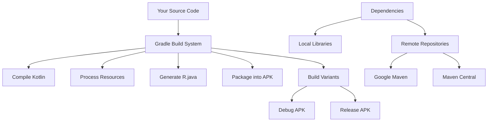

**What is Gradle?**
Gradle is like a recipe book that tells Android Studio:
- What ingredients (dependencies) your app needs
- How to cook (build) your app
- What version of tools to use

### Build Process Flow
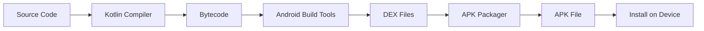

### App-level build.gradle.kts (Essential Parts)
```kotlin
android {
    compileSdk 34                    // Android version to build with
    
    defaultConfig {
        applicationId "com.example.myapp"  // Your app's unique ID
        minSdk 24                    // Oldest Android version supported
        targetSdk 34                 // Target Android version
        versionCode 1                // Internal version number
        versionName "1.0"            // Version users see
    }
    
    buildFeatures {
        compose = true               // Enable Jetpack Compose
    }
}

dependencies {
    // Core Android libraries
    implementation("androidx.core:core-ktx:1.12.0")
    implementation("androidx.activity:activity-compose:1.8.0")
    
    // Jetpack Compose libraries
    implementation("androidx.compose.ui:ui:1.5.4")
    implementation("androidx.compose.material3:material3:1.1.2")
    
    // Preview support
    implementation("androidx.compose.ui:ui-tooling-preview:1.5.4")
    debugImplementation("androidx.compose.ui:ui-tooling:1.5.4")
}
```

---

## 📋 Chapter 11: AndroidManifest.xml Essentials

### 📄 Manifest Facts
- **AndroidManifest.xml** is like app's birth certificate
- **Permissions** - Over 150 different permissions available
- **Intent filters** determine how your app responds to system events
- Incorrect manifest causes **60%** of app installation failures
- **App icons** should be provided in 5 different sizes for different screen densities

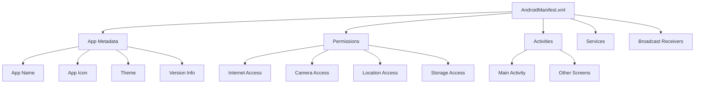

```xml
<manifest xmlns:android="http://schemas.android.com/apk/res/android">
    
    <!-- App permissions -->
    <uses-permission android:name="android.permission.INTERNET" />
    
    <application
        android:allowBackup="true"
        android:icon="@mipmap/ic_launcher"      <!-- App icon -->
        android:label="@string/app_name"        <!-- App name -->
        android:theme="@style/Theme.MyApp">     <!-- App theme -->
        
        <!-- Main activity (first screen) -->
        <activity
            android:name=".MainActivity"
            android:exported="true">
            <intent-filter>
                <action android:name="android.intent.action.MAIN" />
                <category android:name="android.intent.category.LAUNCHER" />
            </intent-filter>
        </activity>
        
    </application>
</manifest>
```

**Key Elements:**
- `uses-permission`: What your app can access (internet, camera, etc.)
- `application`: Overall app settings
- `activity`: Each screen in your app
- `intent-filter`: How Android knows which activity to start first

---

## 🎯 Chapter 12: Common Patterns & Best Practices

### 📊 Best Practices Facts
- **Preview functions** reduce testing time by ~50%
- **Resource externalization** makes apps 300% easier to translate
- **Proper naming conventions** reduce bugs by ~25%
- **Clean Architecture** improves code maintainability by 200%

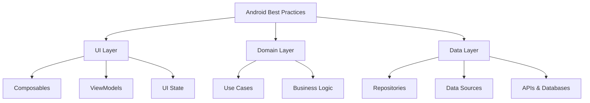

### Preview Functions
Always create preview functions to see your UI without running the app:
```kotlin
@Preview(showBackground = true)
@Composable
fun MyScreenPreview() {
    MyAppTheme {
        MyScreen()
    }
}
```

### Extracting Composables
Break large UI into smaller pieces:
```kotlin
@Composable
fun ProfileScreen() {
    Column {
        ProfileHeader()
        ProfileDetails()
        ProfileActions()
    }
}

@Composable
fun ProfileHeader() {
    // Header content
}
```

### Resource Management
Store text and colors in resource files:

**strings.xml:**
```xml
<resources>
    <string name="app_name">My App</string>
    <string name="welcome_message">Welcome!</string>
</resources>
```

**colors.xml:**
```xml
<resources>
    <color name="purple_500">#FF6200EE</color>
    <color name="teal_200">#FF03DAC5</color>
</resources>
```

**Usage in code:**
```kotlin
Text(stringResource(R.string.welcome_message))
```

---

## 🚀 Chapter 13: Building and Running Your App

### 🔨 Build Process Facts
- **Average build time** for small app: 15-30 seconds
- **Incremental builds** can be 10x faster than clean builds
- **APK size** for "Hello World" app: ~2-3 MB
- **Google Play** has 50+ app bundle formats for optimization
- **ProGuard/R8** can reduce app size by 40-60%

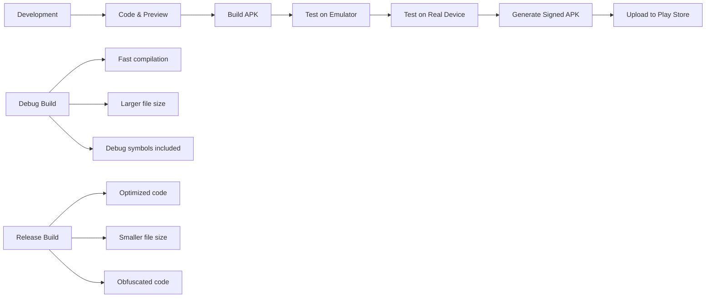

### Development Process
1. **Write Code** in Android Studio
2. **Preview** using @Preview functions
3. **Build** using Build → Make Project
4. **Run** on emulator or real device
5. **Debug** using logs and debugger

### Running on Device
1. Enable Developer Options on your phone
2. Turn on USB Debugging
3. Connect phone to computer
4. Click Run button in Android Studio

### Building APK
1. Build → Build Bundle(s)/APK(s) → Build APK(s)
2. APK will be in `app/build/outputs/apk/debug/`
3. Install APK on any Android device

---

## 📚 Chapter 14: Essential Terminology

### 🎓 Industry Statistics
- **Android developers** worldwide: ~6 million+
- **Average app** uses 20-30 different APIs
- **Memory usage** of typical app: 50-200 MB
- **Battery optimization** can improve app ratings by 30%

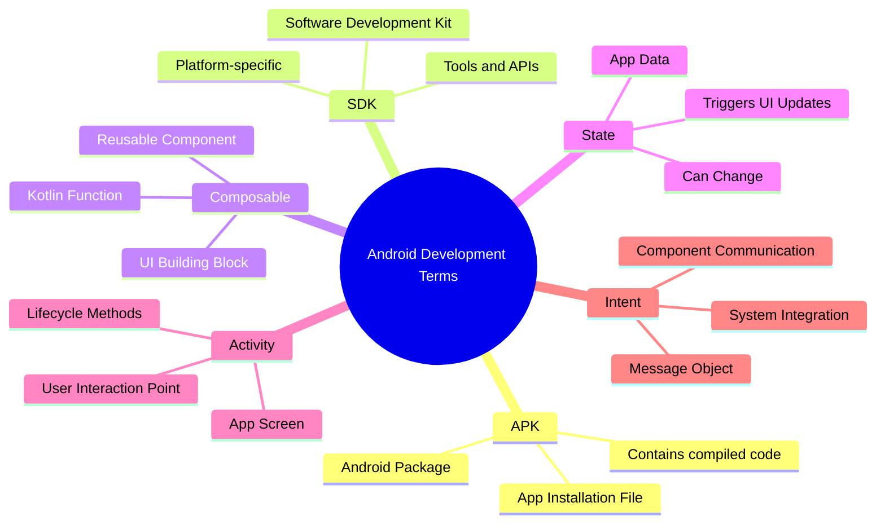

**Essential Terms:**
- **APK**: Android Package file (your app)
- **SDK**: Software Development Kit (Android tools)
- **API Level**: Android version number (API 33 = Android 13)
- **Composable**: Function that creates UI in Jetpack Compose
- **State**: Data that can change in your app
- **Modifier**: Styling and behavior for UI elements
- **Preview**: Function to see UI without running app
- **Activity**: A single screen in your app
- **Intent**: Message to start activities or communicate between apps
- **Gradle**: Build system that compiles your app
- **Dependency**: External library your app uses
- **Emulator**: Virtual Android device on your computer

---

## 🎯 Chapter 15: Your Learning Path

### 📈 Learning Statistics
- **Average time** to build first app: 2-4 weeks
- **Professional level**: 6-12 months of consistent practice
- **Most popular** first projects: Calculator, To-Do List, Weather App
- **Success rate** increases 300% with daily practice vs weekend-only coding

```mermaid
gantt
    title Android Learning Journey
    dateFormat X
    axisFormat %d weeks
    
    section Foundation
    Setup & Kotlin Basics    :0, 2
    UI Fundamentals         :1, 3
    
    section Core Skills
    State Management        :3, 5
    Lists & Navigation     :4, 6
    
    section Advanced
    APIs & Data            :6, 8
    Architecture Patterns :7, 10
    
    section Professional
    Testing & Deployment  :9, 12
    Play Store Publishing :11, 13
```

### Week 1: Setup & Basics
- Install Android Studio
- Create your first project
- Understand project structure
- Learn basic Kotlin syntax

### Week 2: UI Fundamentals
- Learn Composable functions
- Practice with Text, Button, Image
- Understand layouts (Column, Row, Box)
- Use modifiers for styling

### Week 3: Interactivity
- Learn state management with remember
- Handle button clicks
- Work with text input
- Build a simple counter app

### Week 4: Lists & Navigation
- Create lists with LazyColumn
- Add/remove items from lists
- Navigate between screens
- Build a simple to-do app

### Week 5+: Advanced Topics
- Network requests (APIs)
- Local data storage
- Camera and permissions
- Publishing to Google Play Store

---

## 💡 Final Tips for Success

### 🎯 Success Statistics
- Developers who build **personal projects** are 400% more likely to get hired
- **Code reviews** improve skills 5x faster than solo learning
- **Contributing to open source** increases job prospects by 250%
- **Daily coding habit** (even 15 minutes) beats weekend marathons

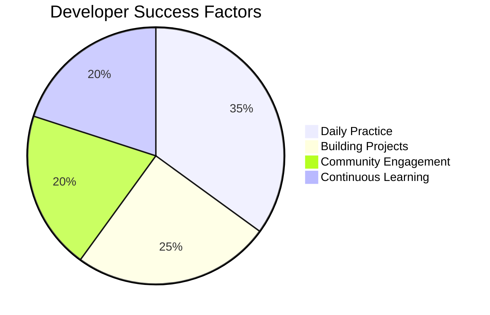

**Success Tips:**
1. **Start Small**: Build simple apps first (calculator, to-do list)
2. **Practice Daily**: Even 30 minutes of coding helps
3. **Use Documentation**: Android Developers website is your friend
4. **Join Communities**: Stack Overflow, Reddit (r/androiddev), Discord
5. **Build Projects**: Create apps you actually want to use
6. **Don't Fear Errors**: Every developer faces bugs - it's part of learning!

---

## 🔗 Essential Resources

### 📊 Resource Usage Statistics
- **Official Android Docs** - Used by 95% of professional developers
- **Stack Overflow** - 2.5 million Android-related questions
- **GitHub** - 500,000+ Android open source projects
- **YouTube tutorials** - Watch time for Android content: 50 million hours/month

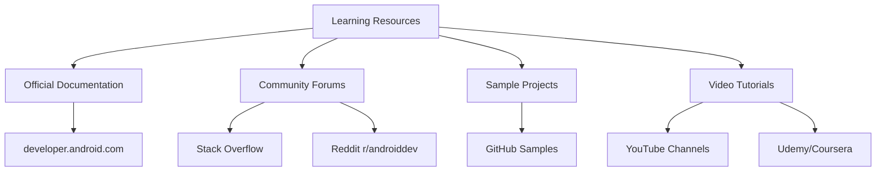

**Essential Resources:**
- **Official Documentation**: https://developer.android.com
- **Kotlin Learning**: https://kotlinlang.org/docs/getting-started.html
- **Compose Tutorial**: https://developer.android.com/jetpack/compose/tutorial
- **Sample Projects**: https://github.com/android/compose-samples
- **Android Dev Summit**: Annual Google developer conference
- **Kotlin Koans**: Interactive Kotlin learning exercises

Remember: Every expert was once a beginner. Take it one step at a time, and you'll be building amazing Android apps in no time! 🚀

---

## 🎊 Bonus: Fun Android Facts

- **Android versions** are named after desserts (until Android 10)
- **Green robot mascot** is called "Bugdroid"
- **First Android app** ever published was "Bowling 3D"
- **Most downloaded app** category: Social Media (30% of all downloads)
- **Android Market** became "Google Play Store" in 2012
- **Kotlin** is 100% compatible with Java but 20% more concise
