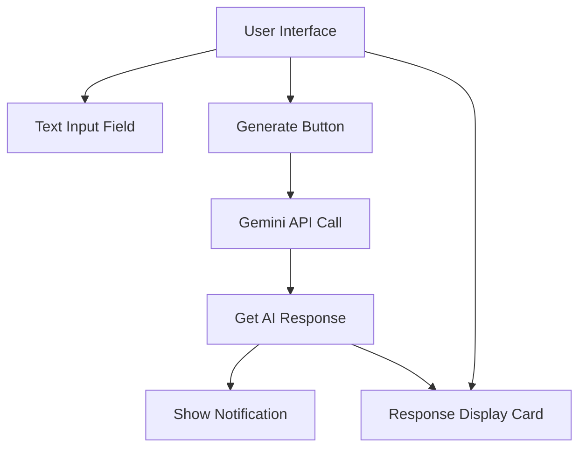
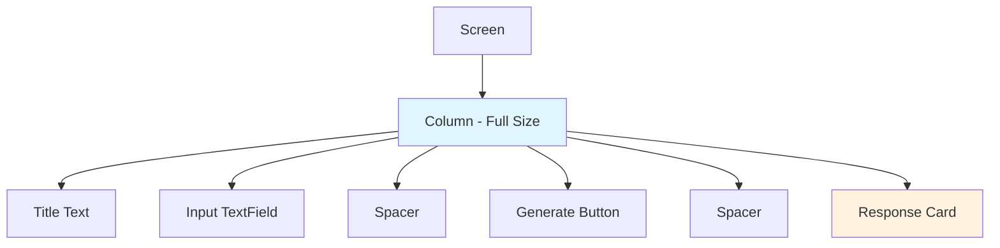
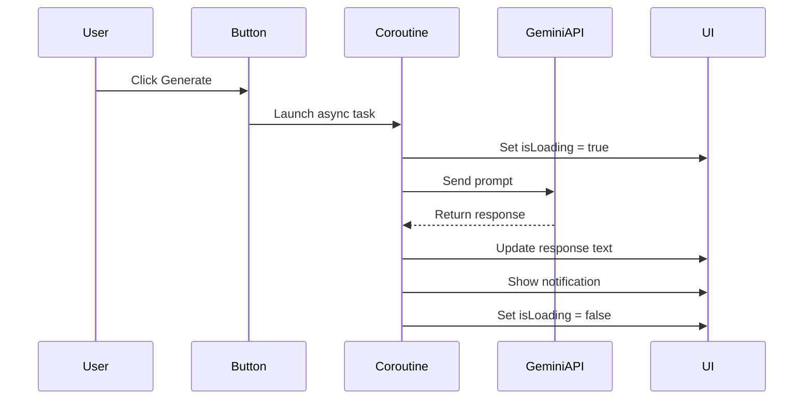
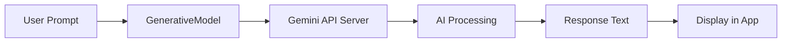
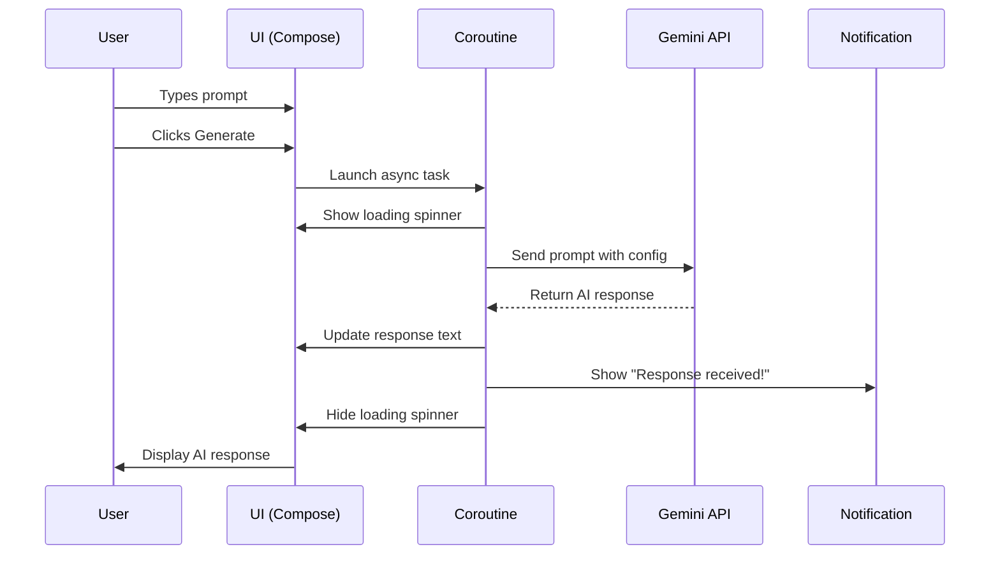

# Gemini AI Android App - Complete Code Explanation

This document explains a Kotlin Android app built with Jetpack Compose that integrates with Google's Gemini AI API. Perfect for beginners learning Android development!

## Overview

This app allows users to:
- Enter text prompts
- Send them to Google's Gemini AI
- Display the AI-generated responses
- Receive notifications when responses arrive

## Application Architecture



---

## Code Breakdown

### 1. Package Declaration and Imports

```kotlin
package com.example.lpugenai
```

This defines the app's unique package name, which identifies your app in the Android ecosystem.

```kotlin
import android.Manifest
import android.app.NotificationChannel
import android.app.NotificationManager
```

These imports handle **notifications**:
- `Manifest`: For permission constants
- `NotificationChannel`: Required for Android 8.0+ to categorize notifications
- `NotificationManager`: Manages notification delivery

```kotlin
import androidx.compose.foundation.layout.*
import androidx.compose.material3.*
import androidx.compose.runtime.*
```

**Jetpack Compose** imports for building the UI:
- `foundation.layout`: Layout components (Column, Row, Spacer, padding)
- `material3`: Material Design 3 components (Button, Card, TextField)
- `runtime`: State management (remember, mutableStateOf)

```kotlin
import com.google.ai.client.generativeai.GenerativeModel
```

The **Gemini AI SDK** for making API calls to Google's AI model.

---

### 2. MainActivity Class

```kotlin
class MainActivity : ComponentActivity() {
    override fun onCreate(savedInstanceState: Bundle?) {
        super.onCreate(savedInstanceState)
        createNotificationChannel()

        setContent {
            MaterialTheme {
                Surface(
                    modifier = Modifier.fillMaxSize(),
                    color = MaterialTheme.colorScheme.background
                ) {
                    GeminiApp()
                }
            }
        }
    }
```

**What happens here:**

1. `ComponentActivity`: The base class for Compose-based activities
2. `onCreate()`: Called when the app launches
3. `createNotificationChannel()`: Sets up notifications (required for Android 8.0+)
4. `setContent {}`: Defines the UI using Compose (replaces XML layouts)
5. `MaterialTheme`: Applies Material Design theming
6. `Surface`: A container that fills the screen
7. `GeminiApp()`: The main UI function

#### Notification Channel Setup

```kotlin
private fun createNotificationChannel() {
    if (Build.VERSION.SDK_INT >= Build.VERSION_CODES.O) {
        val channel = NotificationChannel(
            CHANNEL_ID,
            "Gemini Responses",
            NotificationManager.IMPORTANCE_DEFAULT
        ).apply {
            description = "Notifications for AI responses"
        }
        val notificationManager = getSystemService(Context.NOTIFICATION_SERVICE) as NotificationManager
        notificationManager.createNotificationChannel(channel)
    }
}
```

**Why this matters:**
- Android 8.0+ requires notification channels
- Users can customize notification settings per channel
- Channels group related notifications together

**How it works:**
1. Check if Android version is Oreo (8.0) or higher
2. Create a channel with an ID, name, and importance level
3. Register the channel with the system's NotificationManager

---

### 3. GeminiApp Composable (The UI)

```kotlin
@Composable
fun GeminiApp() {
    var prompt by remember { mutableStateOf("") }
    var response by remember { mutableStateOf("") }
    var isLoading by remember { mutableStateOf(false) }
    val scope = rememberCoroutineScope()
    val context = LocalContext.current
    val scrollState = rememberScrollState()
```

#### State Management

**State variables** track data that can change:

| Variable | Type | Purpose |
|----------|------|---------|
| `prompt` | String | User's input text |
| `response` | String | AI's response |
| `isLoading` | Boolean | Shows loading indicator |
| `scope` | CoroutineScope | Manages async operations |
| `context` | Context | Android context for notifications |
| `scrollState` | ScrollState | Enables scrolling in response area |

**`remember { mutableStateOf("") }`** means:
- The value persists across recompositions (UI updates)
- When the value changes, the UI automatically updates

#### UI Layout

```kotlin
Column(
    modifier = Modifier
        .fillMaxSize()
        .padding(16.dp),
    horizontalAlignment = Alignment.CenterHorizontally
) {
```

**Column**: Arranges children vertically
- `fillMaxSize()`: Takes up full screen
- `padding(16.dp)`: Adds 16dp space around edges
- `horizontalAlignment`: Centers items horizontally



#### Title Text

```kotlin
Text(
    text = "Gemini AI Chat",
    style = MaterialTheme.typography.headlineMedium,
    fontWeight = FontWeight.Bold,
    modifier = Modifier.padding(bottom = 24.dp)
)
```

Simple text with Material Design styling and bottom padding.

#### Input TextField

```kotlin
OutlinedTextField(
    value = prompt,
    onValueChange = { prompt = it },
    label = { Text("Enter your prompt") },
    modifier = Modifier
        .fillMaxWidth()
        .height(120.dp),
    maxLines = 4,
    enabled = !isLoading
)
```

**How it works:**
- `value = prompt`: Shows current prompt text
- `onValueChange = { prompt = it }`: Updates prompt when user types
- `enabled = !isLoading`: Disables input while loading
- `maxLines = 4`: Allows multi-line input (up to 4 lines visible)

#### Generate Button

```kotlin
Button(
    onClick = {
        if (prompt.isNotBlank()) {
            scope.launch {
                isLoading = true
                response = ""

                try {
                    val result = getGeminiResponse(prompt)
                    response = result
                    showNotification(context, "Response received!")
                } catch (e: Exception) {
                    response = "Error: ${e.message}"
                    showNotification(context, "Error occurred")
                } finally {
                    isLoading = false
                }
            }
        }
    },
    enabled = !isLoading && prompt.isNotBlank()
) {
```

**Button click flow:**



**Key concepts:**
- `scope.launch {}`: Runs code asynchronously (doesn't freeze UI)
- `try-catch-finally`: Handles errors gracefully
- Button is disabled when loading or prompt is empty

#### Loading Indicator vs Button Text

```kotlin
if (isLoading) {
    CircularProgressIndicator(
        modifier = Modifier.size(24.dp),
        color = MaterialTheme.colorScheme.onPrimary
    )
} else {
    Text("Generate Response")
}
```

Shows a spinning circle while loading, text otherwise.

#### Response Card

```kotlin
if (response.isNotEmpty()) {
    Card(
        modifier = Modifier
            .fillMaxWidth()
            .weight(1f),
        colors = CardDefaults.cardColors(
            containerColor = MaterialTheme.colorScheme.secondaryContainer
        )
    ) {
        Column(
            modifier = Modifier
                .fillMaxSize()
                .padding(16.dp)
                .verticalScroll(scrollState)
        ) {
            Text(
                text = "Response:",
                style = MaterialTheme.typography.titleMedium,
                fontWeight = FontWeight.Bold,
                modifier = Modifier.padding(bottom = 8.dp)
            )
            Text(
                text = response,
                style = MaterialTheme.typography.bodyMedium
            )
        }
    }
}
```

**Card component** creates a raised, rounded container:
- Only visible when `response` is not empty
- `.weight(1f)`: Takes remaining vertical space
- `.verticalScroll(scrollState)`: Makes content scrollable
- Shows label "Response:" followed by the AI's text

---

### 4. Gemini API Integration

```kotlin
suspend fun getGeminiResponse(prompt: String): String = withContext(Dispatchers.IO) {
    val apiKey = "xxxxxxxxxxxxxxxxxxxxxxxxxxxxxxxxxxxxxxxx"

    val generativeModel = GenerativeModel(
        modelName = "gemini-2.5-flash",
        apiKey = apiKey,
        generationConfig = generationConfig {
            temperature = 0.7f
            topK = 40
            topP = 0.95f
            maxOutputTokens = 1024
        }
    )

    val result = generativeModel.generateContent(prompt)
    result.text ?: "No response generated"
}
```

#### Understanding `suspend` Functions

**`suspend`** means this function can be paused and resumed:
- Runs on a background thread (doesn't block UI)
- Must be called from a coroutine (like `scope.launch {}`)

**`withContext(Dispatchers.IO)`** switches to an I/O-optimized thread for network calls.

#### Configuration Parameters

| Parameter | Value | What It Does |
|-----------|-------|--------------|
| `modelName` | "gemini-2.5-flash" | The AI model to use (fast version) |
| `temperature` | 0.7 | Creativity level (0=focused, 1=creative) |
| `topK` | 40 | Considers top 40 word options |
| `topP` | 0.95 | Nucleus sampling threshold |
| `maxOutputTokens` | 1024 | Maximum response length |

**Temperature analogy:**
- Low (0.3): Like a focused student giving precise answers
- Medium (0.7): Balanced creativity and accuracy
- High (1.0): Like a creative writer exploring possibilities

#### API Call Flow



---

### 5. Notification System

```kotlin
fun showNotification(context: Context, message: String) {
    val notification = NotificationCompat.Builder(context, MainActivity.CHANNEL_ID)
        .setSmallIcon(R.drawable.ic_dialog_info)
        .setContentTitle("Gemini AI")
        .setContentText(message)
        .setPriority(NotificationCompat.PRIORITY_DEFAULT)
        .setAutoCancel(true)
        .build()

    if (Build.VERSION.SDK_INT >= Build.VERSION_CODES.TIRAMISU) {
        NotificationManagerCompat.from(context).notify(1, notification)
    } else {
        NotificationManagerCompat.from(context).notify(1, notification)
    }
}
```

**Notification properties:**
- `setSmallIcon()`: Icon shown in status bar
- `setContentTitle()`: Bold title text
- `setContentText()`: Message body
- `setAutoCancel(true)`: Dismisses when tapped
- `notify(1, notification)`: Shows notification with ID 1

**Android 13+ note:** Requires POST_NOTIFICATIONS permission (declared with `@RequiresPermission`).

---

## Complete Data Flow



---

## Key Concepts for Beginners

### 1. **Jetpack Compose**
- Modern UI toolkit (no XML!)
- Declarative: Describe what UI should look like
- State-driven: UI automatically updates when data changes

### 2. **Coroutines**
- Handle async operations (network, database)
- Prevent UI freezing
- `launch {}`: Fire and forget
- `suspend`: Function can be paused

### 3. **State Management**
- `remember { mutableStateOf() }`: Persistent state
- When state changes, Compose recomposes affected UI

### 4. **Material Design 3**
- Modern design system by Google
- Components: Button, Card, TextField, etc.
- Theming: Consistent colors, typography, shapes

### 5. **API Integration**
- Network calls on background threads
- Error handling with try-catch
- Configuration parameters tune AI behavior

---

## Important Notes

### Security Concern
```kotlin
val apiKey = "xxxxxxxxxxxxxxxxxxxxxxxx"
```

**⚠️ Never hardcode API keys in production apps!**

Better approaches:
1. Use `BuildConfig` with gradle properties
2. Store in `local.properties` (not version controlled)
3. Use a backend server to proxy API calls

### Permissions Needed

Add to `AndroidManifest.xml`:
```xml
<uses-permission android:name="android.permission.INTERNET" />
<uses-permission android:name="android.permission.POST_NOTIFICATIONS" />
```

### Dependencies Required

Add to `build.gradle`:
```gradle
implementation("com.google.ai.client.generativeai:generativeai:0.1.2")
implementation("androidx.compose.material3:material3")
```

---

## Summary

This app demonstrates:
✅ Modern Android UI with Jetpack Compose  
✅ Async operations with Coroutines  
✅ AI integration with Gemini API  
✅ State management in Compose  
✅ Notification system  
✅ Error handling  

Perfect foundation for building AI-powered Android apps!
