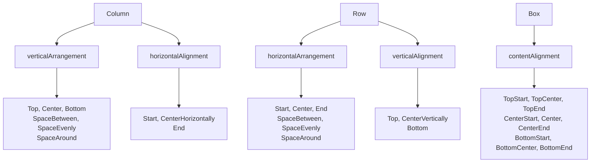

# 🎨 Jetpack Compose Composables - Complete Study Guide

## 📖 What Are Composables?

**Composables** are functions that create UI elements in Jetpack Compose. Think of them as LEGO blocks - you combine them to build your app's interface!

### 🔑 Key Facts:
- **@Composable** annotation makes a function create UI
- They describe **what** the UI should look like, not **how** to build it
- Can be combined and nested inside each other
- Automatically update when data changes

---

## 🏗️ Layout Composables (Containers)

### Box - Stack Things on Top of Each Other

```kotlin
package com.example.composables

import android.os.Bundle
import androidx.activity.ComponentActivity
import androidx.activity.compose.setContent
import androidx.compose.foundation.background
import androidx.compose.foundation.layout.*
import androidx.compose.material3.*
import androidx.compose.runtime.Composable
import androidx.compose.ui.Alignment
import androidx.compose.ui.Modifier
import androidx.compose.ui.graphics.Color
import androidx.compose.ui.tooling.preview.Preview
import androidx.compose.ui.unit.dp

class BoxExampleActivity : ComponentActivity() {
    override fun onCreate(savedInstanceState: Bundle?) {
        super.onCreate(savedInstanceState)
        setContent {
            MaterialTheme {
                BoxExample()
            }
        }
    }
}

@Composable
fun BoxExample() {
    Box(
        modifier = Modifier
            .size(200.dp)
            .background(Color.LightGray),
        contentAlignment = Alignment.Center
    ) {
        Text("I'm centered!")
        Text(
            "I'm on top!",
            modifier = Modifier.align(Alignment.TopStart)
        )
    }
}

@Preview(showBackground = true)
@Composable
fun BoxExamplePreview() {
    MaterialTheme {
        BoxExample()
    }
}
```

**📝 When to use Box:**
- Centering content
- Overlapping elements (like text over image)
- Creating floating elements

### Column - Stack Things Vertically

```kotlin
package com.example.composables

import android.os.Bundle
import androidx.activity.ComponentActivity
import androidx.activity.compose.setContent
import androidx.compose.foundation.layout.*
import androidx.compose.material3.*
import androidx.compose.runtime.Composable
import androidx.compose.ui.Alignment
import androidx.compose.ui.Modifier
import androidx.compose.ui.tooling.preview.Preview
import androidx.compose.ui.unit.dp

class ColumnExampleActivity : ComponentActivity() {
    override fun onCreate(savedInstanceState: Bundle?) {
        super.onCreate(savedInstanceState)
        setContent {
            MaterialTheme {
                ColumnExample()
            }
        }
    }
}

@Composable
fun ColumnExample() {
    Column(
        modifier = Modifier
            .fillMaxWidth()
            .padding(16.dp),
        horizontalAlignment = Alignment.CenterHorizontally,
        verticalArrangement = Arrangement.spacedBy(8.dp)
    ) {
        Text("First Item")
        Text("Second Item")
        Button(onClick = { 
            println("Button clicked!") 
        }) {
            Text("Third Item")
        }
    }
}

@Preview(showBackground = true)
@Composable
fun ColumnExamplePreview() {
    MaterialTheme {
        ColumnExample()
    }
}
```

**📝 When to use Column:**
- Forms
- Lists that go up/down
- Stacking elements vertically

### Row - Place Things Side by Side

```kotlin
package com.example.composables

import android.os.Bundle
import androidx.activity.ComponentActivity
import androidx.activity.compose.setContent
import androidx.compose.foundation.layout.*
import androidx.compose.material3.*
import androidx.compose.runtime.Composable
import androidx.compose.ui.Alignment
import androidx.compose.ui.Modifier
import androidx.compose.ui.tooling.preview.Preview
import androidx.compose.ui.unit.dp

class RowExampleActivity : ComponentActivity() {
    override fun onCreate(savedInstanceState: Bundle?) {
        super.onCreate(savedInstanceState)
        setContent {
            MaterialTheme {
                RowExample()
            }
        }
    }
}

@Composable
fun RowExample() {
    Row(
        modifier = Modifier
            .fillMaxWidth()
            .padding(16.dp),
        horizontalArrangement = Arrangement.SpaceBetween,
        verticalAlignment = Alignment.CenterVertically
    ) {
        Text("Left")
        Text("Middle")
        Text("Right")
    }
}

@Preview(showBackground = true)
@Composable
fun RowExamplePreview() {
    MaterialTheme {
        RowExample()
    }
}
```

**📝 When to use Row:**
- Navigation bars
- Placing items horizontally
- Side-by-side layouts

---

## 📱 Content Composables

### Text - Display Text

```kotlin
package com.example.composables

import android.os.Bundle
import androidx.activity.ComponentActivity
import androidx.activity.compose.setContent
import androidx.compose.foundation.background
import androidx.compose.foundation.layout.*
import androidx.compose.material3.*
import androidx.compose.runtime.Composable
import androidx.compose.ui.Modifier
import androidx.compose.ui.graphics.Color
import androidx.compose.ui.text.font.FontWeight
import androidx.compose.ui.text.style.TextAlign
import androidx.compose.ui.tooling.preview.Preview
import androidx.compose.ui.unit.dp
import androidx.compose.ui.unit.sp

class TextExampleActivity : ComponentActivity() {
    override fun onCreate(savedInstanceState: Bundle?) {
        super.onCreate(savedInstanceState)
        setContent {
            MaterialTheme {
                Surface(
                    modifier = Modifier.fillMaxSize(),
                    color = MaterialTheme.colorScheme.background
                ) {
                    TextExamples()
                }
            }
        }
    }
}

@Composable
fun TextExamples() {
    Column(
        modifier = Modifier.padding(16.dp),
        verticalArrangement = Arrangement.spacedBy(16.dp)
    ) {
        // Basic text
        Text("Simple text")
        
        // Styled text
        Text(
            text = "Styled Text",
            fontSize = 24.sp,
            fontWeight = FontWeight.Bold,
            color = Color.Blue,
            textAlign = TextAlign.Center,
            modifier = Modifier.fillMaxWidth()
        )
        
        // Text with background
        Text(
            text = "Background Text",
            modifier = Modifier
                .background(Color.Yellow)
                .padding(8.dp)
        )
    }
}

@Preview(showBackground = true)
@Composable
fun TextExamplesPreview() {
    MaterialTheme {
        TextExamples()
    }
}
```

### Button - Clickable Actions

```kotlin
package com.example.composables

import android.os.Bundle
import androidx.activity.ComponentActivity
import androidx.activity.compose.setContent
import androidx.compose.foundation.layout.*
import androidx.compose.material.icons.Icons
import androidx.compose.material.icons.filled.Favorite
import androidx.compose.material3.*
import androidx.compose.runtime.Composable
import androidx.compose.ui.Alignment
import androidx.compose.ui.Modifier
import androidx.compose.ui.tooling.preview.Preview
import androidx.compose.ui.unit.dp

class ButtonExampleActivity : ComponentActivity() {
    override fun onCreate(savedInstanceState: Bundle?) {
        super.onCreate(savedInstanceState)
        setContent {
            MaterialTheme {
                Surface(
                    modifier = Modifier.fillMaxSize(),
                    color = MaterialTheme.colorScheme.background
                ) {
                    ButtonExamples()
                }
            }
        }
    }
}

@Composable
fun ButtonExamples() {
    Column(
        modifier = Modifier
            .fillMaxSize()
            .padding(16.dp),
        horizontalAlignment = Alignment.CenterHorizontally,
        verticalArrangement = Arrangement.spacedBy(12.dp)
    ) {
        // Regular button
        Button(onClick = { 
            println("Button clicked!") 
        }) {
            Text("Click Me")
        }
        
        // Outlined button
        OutlinedButton(onClick = { 
            println("Outlined button clicked!") 
        }) {
            Text("Outlined")
        }
        
        // Text button
        TextButton(onClick = { 
            println("Text button clicked!") 
        }) {
            Text("Text Button")
        }
        
        // Button with icon
        Button(onClick = { 
            println("Like button clicked!") 
        }) {
            Icon(Icons.Default.Favorite, contentDescription = "Heart icon")
            Spacer(Modifier.width(4.dp))
            Text("Like")
        }
    }
}

@Preview(showBackground = true)
@Composable
fun ButtonExamplesPreview() {
    MaterialTheme {
        ButtonExamples()
    }
}
```

### Image - Display Pictures

```kotlin
package com.example.composables

import android.os.Bundle
import androidx.activity.ComponentActivity
import androidx.activity.compose.setContent
import androidx.compose.foundation.Image
import androidx.compose.foundation.background
import androidx.compose.foundation.layout.*
import androidx.compose.foundation.shape.CircleShape
import androidx.compose.material.icons.Icons
import androidx.compose.material.icons.filled.Star
import androidx.compose.material3.*
import androidx.compose.runtime.Composable
import androidx.compose.ui.Alignment
import androidx.compose.ui.Modifier
import androidx.compose.ui.draw.clip
import androidx.compose.ui.graphics.Color
import androidx.compose.ui.layout.ContentScale
import androidx.compose.ui.res.painterResource
import androidx.compose.ui.tooling.preview.Preview
import androidx.compose.ui.unit.dp

class ImageExampleActivity : ComponentActivity() {
    override fun onCreate(savedInstanceState: Bundle?) {
        super.onCreate(savedInstanceState)
        setContent {
            MaterialTheme {
                Surface(
                    modifier = Modifier.fillMaxSize(),
                    color = MaterialTheme.colorScheme.background
                ) {
                    ImageExamples()
                }
            }
        }
    }
}

@Composable
fun ImageExamples() {
    Column(
        modifier = Modifier
            .fillMaxSize()
            .padding(16.dp),
        horizontalAlignment = Alignment.CenterHorizontally,
        verticalArrangement = Arrangement.spacedBy(16.dp)
    ) {
        // Image from resources (you need to add an image to res/drawable/)
        // Image(
        //     painter = painterResource(id = R.drawable.my_image),
        //     contentDescription = "My image description",
        //     modifier = Modifier.size(100.dp)
        // )
        
        // For demo, using a placeholder
        Box(
            modifier = Modifier
                .size(100.dp)
                .background(Color.Gray),
            contentAlignment = Alignment.Center
        ) {
            Text("Image Placeholder")
        }
        
        // Icon as image (works without additional resources)
        Image(
            imageVector = Icons.Default.Star,
            contentDescription = "Star icon",
            modifier = Modifier.size(48.dp)
        )
        
        // Circular icon with background
        Image(
            imageVector = Icons.Default.Star,
            contentDescription = "Circular star",
            modifier = Modifier
                .size(48.dp)
                .background(Color.Yellow, CircleShape)
                .padding(8.dp)
        )
    }
}

@Preview(showBackground = true)
@Composable
fun ImageExamplesPreview() {
    MaterialTheme {
        ImageExamples()
    }
}
```

---

## 🎛️ Modifiers - The Styling System

Modifiers are like CSS for Compose - they control how composables look and behave.

### Complete Modifier Examples

```kotlin
package com.example.composables

import android.os.Bundle
import androidx.activity.ComponentActivity
import androidx.activity.compose.setContent
import androidx.compose.foundation.background
import androidx.compose.foundation.border
import androidx.compose.foundation.clickable
import androidx.compose.foundation.layout.*
import androidx.compose.foundation.shape.RoundedCornerShape
import androidx.compose.material3.*
import androidx.compose.runtime.Composable
import androidx.compose.ui.Modifier
import androidx.compose.ui.graphics.Color
import androidx.compose.ui.tooling.preview.Preview
import androidx.compose.ui.unit.dp

class ModifierExampleActivity : ComponentActivity() {
    override fun onCreate(savedInstanceState: Bundle?) {
        super.onCreate(savedInstanceState)
        setContent {
            MaterialTheme {
                Surface(
                    modifier = Modifier.fillMaxSize(),
                    color = MaterialTheme.colorScheme.background
                ) {
                    ModifierExamples()
                }
            }
        }
    }
}

@Composable
fun ModifierExamples() {
    Column(
        modifier = Modifier.padding(16.dp),
        verticalArrangement = Arrangement.spacedBy(16.dp)
    ) {
        // Size modifiers
        Text(
            "Fixed size",
            modifier = Modifier.size(100.dp, 50.dp)
        )
        
        Text(
            "Fill width",
            modifier = Modifier.fillMaxWidth()
        )
        
        // Padding examples
        Text(
            "With padding",
            modifier = Modifier
                .background(Color.LightBlue)
                .padding(16.dp)
        )
        
        // Background and shape
        Text(
            "Styled box",
            modifier = Modifier
                .background(Color.Blue, RoundedCornerShape(8.dp))
                .padding(12.dp),
            color = Color.White
        )
        
        // Clickable
        Text(
            "Clickable text (tap me!)",
            modifier = Modifier
                .clickable { 
                    println("Text clicked!") 
                }
                .background(Color.LightGray)
                .padding(8.dp)
        )
        
        // Border
        Text(
            "With border",
            modifier = Modifier
                .border(2.dp, Color.Red, RoundedCornerShape(4.dp))
                .padding(8.dp)
        )
        
        // Combined modifiers
        Text(
            "All combined!",
            modifier = Modifier
                .fillMaxWidth()
                .background(Color.Green, RoundedCornerShape(12.dp))
                .border(3.dp, Color.DarkGreen, RoundedCornerShape(12.dp))
                .clickable { println("Combined modifiers clicked!") }
                .padding(16.dp),
            color = Color.White
        )
    }
}

@Preview(showBackground = true)
@Composable
fun ModifierExamplesPreview() {
    MaterialTheme {
        ModifierExamples()
    }
}
```

### 🔗 Modifier Chaining Demo

```kotlin
package com.example.composables

import android.os.Bundle
import androidx.activity.ComponentActivity
import androidx.activity.compose.setContent
import androidx.compose.foundation.background
import androidx.compose.foundation.layout.*
import androidx.compose.material3.*
import androidx.compose.runtime.Composable
import androidx.compose.ui.Modifier
import androidx.compose.ui.graphics.Color
import androidx.compose.ui.text.font.FontWeight
import androidx.compose.ui.tooling.preview.Preview
import androidx.compose.ui.unit.dp

class ModifierOrderActivity : ComponentActivity() {
    override fun onCreate(savedInstanceState: Bundle?) {
        super.onCreate(savedInstanceState)
        setContent {
            MaterialTheme {
                ModifierOrderDemo()
            }
        }
    }
}

@Composable
fun ModifierOrderDemo() {
    Column(
        modifier = Modifier.padding(16.dp),
        verticalArrangement = Arrangement.spacedBy(16.dp)
    ) {
        Text(
            "Order Matters!",
            fontWeight = FontWeight.Bold
        )
        
        // Wrong order - padding inside background
        Text(
            "❌ Padding then background",
            modifier = Modifier
                .padding(16.dp)        // This padding won't show
                .background(Color.Red),
            color = Color.White
        )
        
        // Correct order - background first, then padding
        Text(
            "✅ Background then padding",
            modifier = Modifier
                .background(Color.Green)
                .padding(16.dp),       // This padding will show
            color = Color.White
        )
    }
}

@Preview(showBackground = true)
@Composable
fun ModifierOrderDemoPreview() {
    MaterialTheme {
        ModifierOrderDemo()
    }
}
```

---

## 📊 Layout Arrangement & Alignment



---

## 🎯 Complete Example - Profile Card

```kotlin
package com.example.composables

import android.os.Bundle
import androidx.activity.ComponentActivity
import androidx.activity.compose.setContent
import androidx.compose.foundation.Image
import androidx.compose.foundation.background
import androidx.compose.foundation.layout.*
import androidx.compose.foundation.shape.CircleShape
import androidx.compose.material.icons.Icons
import androidx.compose.material.icons.filled.Person
import androidx.compose.material3.*
import androidx.compose.runtime.Composable
import androidx.compose.ui.Alignment
import androidx.compose.ui.Modifier
import androidx.compose.ui.draw.clip
import androidx.compose.ui.graphics.Color
import androidx.compose.ui.layout.ContentScale
import androidx.compose.ui.text.font.FontWeight
import androidx.compose.ui.tooling.preview.Preview
import androidx.compose.ui.unit.dp
import androidx.compose.ui.unit.sp

class ProfileCardActivity : ComponentActivity() {
    override fun onCreate(savedInstanceState: Bundle?) {
        super.onCreate(savedInstanceState)
        setContent {
            MaterialTheme {
                Surface(
                    modifier = Modifier.fillMaxSize(),
                    color = MaterialTheme.colorScheme.background
                ) {
                    ProfileCardScreen()
                }
            }
        }
    }
}

@Composable
fun ProfileCardScreen() {
    Column(
        modifier = Modifier
            .fillMaxSize()
            .padding(16.dp),
        verticalArrangement = Arrangement.Center
    ) {
        ProfileCard()
    }
}

@Composable
fun ProfileCard() {
    Card(
        modifier = Modifier.fillMaxWidth(),
        elevation = CardDefaults.cardElevation(defaultElevation = 4.dp)
    ) {
        Row(
            modifier = Modifier.padding(16.dp),
            verticalAlignment = Alignment.CenterVertically
        ) {
            // Profile image placeholder (using icon since we don't have actual image)
            Box(
                modifier = Modifier
                    .size(60.dp)
                    .background(Color.LightGray, CircleShape),
                contentAlignment = Alignment.Center
            ) {
                Image(
                    imageVector = Icons.Default.Person,
                    contentDescription = "Profile picture",
                    modifier = Modifier.size(40.dp)
                )
            }
            
            // Spacer for gap
            Spacer(modifier = Modifier.width(16.dp))
            
            // Text content
            Column(
                modifier = Modifier.weight(1f)
            ) {
                Text(
                    text = "John Doe",
                    fontSize = 18.sp,
                    fontWeight = FontWeight.Bold
                )
                Text(
                    text = "Android Developer",
                    fontSize = 14.sp,
                    color = Color.Gray
                )
            }
            
            // Action button
            Button(
                onClick = { 
                    println("Follow button clicked!") 
                },
                modifier = Modifier.height(36.dp)
            ) {
                Text("Follow")
            }
        }
    }
}

@Preview(showBackground = true)
@Composable
fun ProfileCardPreview() {
    MaterialTheme {
        ProfileCardScreen()
    }
}
```

---

## ❓ Frequently Asked Questions (FAQs)

### Q: What's the difference between Box, Column, and Row?
**A:** 
- **Box**: Stack things on top of each other (Z-axis)
- **Column**: Arrange things vertically (top to bottom)
- **Row**: Arrange things horizontally (left to right)

### Q: Why do modifiers order matter?
**A:** Each modifier wraps the previous one. Like putting on clothes - you put on a shirt first, then a jacket. The order changes the final result!

### Q: When should I use weight() modifier?
**A:** Use `weight()` in Row/Column to make an item take up remaining space or share space proportionally.

```kotlin
Row {
    Text("Fixed", modifier = Modifier.weight(1f))  // Takes 1 part
    Text("Bigger", modifier = Modifier.weight(2f)) // Takes 2 parts
}
```

### Q: How do I center something?
**A:** 
- **In Box**: `contentAlignment = Alignment.Center`
- **In Column**: `horizontalAlignment = Alignment.CenterHorizontally`
- **In Row**: `verticalAlignment = Alignment.CenterVertically`

### Q: What's contentDescription for in Image?
**A:** It's for accessibility! Screen readers use it to describe images to visually impaired users.

### Q: Can I nest composables?
**A:** Absolutely! You can put Rows inside Columns, Boxes inside Rows, etc. That's how you build complex layouts.

### Q: What's the difference between padding() and margin?
**A:** Compose only has `padding()`. It adds space inside the element. For margin-like effects, wrap in another container or use `Spacer()`.

### Q: How do I add images to my project?
**A:** 
1. Right-click on `app/src/main/res/drawable` in Android Studio
2. Select "New" > "Image Asset" or paste image files there
3. Use `painterResource(R.drawable.your_image_name)` in code

---

## 🎯 Practice Exercises

### Exercise 1: Login Form
```kotlin
@Composable
fun LoginForm() {
    // Create a Column with:
    // - Title text "Login"
    // - Username text field placeholder
    // - Password text field placeholder  
    // - Login button
    // - Sign up text button
}
```

### Exercise 2: Photo Gallery Row
```kotlin
@Composable
fun PhotoGalleryRow() {
    // Create a Row with:
    // - 3 placeholder images
    // - Equal spacing between them
    // - Each image should be 80.dp square
}
```

### Exercise 3: Card with Overlay
```kotlin
@Composable
fun OverlayCard() {
    // Create a Box with:
    // - Background image/color
    // - Text overlay in bottom-left corner
    // - Action button in top-right corner
}
```

---

## 🔧 Quick Reference

| Composable | Purpose | Key Properties | Common Modifiers |
|------------|---------|----------------|------------------|
| `Text()` | Display text | fontSize, fontWeight, color | padding, background |
| `Button()` | Clickable action | onClick, enabled, colors | fillMaxWidth, height |
| `Image()` | Display pictures | painter, contentDescription | size, clip, background |
| `Column()` | Vertical layout | verticalArrangement, horizontalAlignment | fillMaxSize, padding |
| `Row()` | Horizontal layout | horizontalArrangement, verticalAlignment | fillMaxWidth, weight |
| `Box()` | Overlay layout | contentAlignment | size, background |

## 📦 Required Dependencies

Add these to your `app/build.gradle` file:

```kotlin
dependencies {
    implementation "androidx.compose.ui:ui:1.5.4"
    implementation "androidx.compose.ui:ui-tooling-preview:1.5.4"
    implementation "androidx.compose.material3:material3:1.1.2"
    implementation "androidx.activity:activity-compose:1.8.1"
    implementation "androidx.compose.material:material-icons-core:1.5.4"
    implementation "androidx.compose.material:material-icons-extended:1.5.4"
}
```

## 📚 Next Steps
Once you're comfortable with these basics, you'll be ready to learn about **Lazy Lists** for handling large datasets efficiently!
