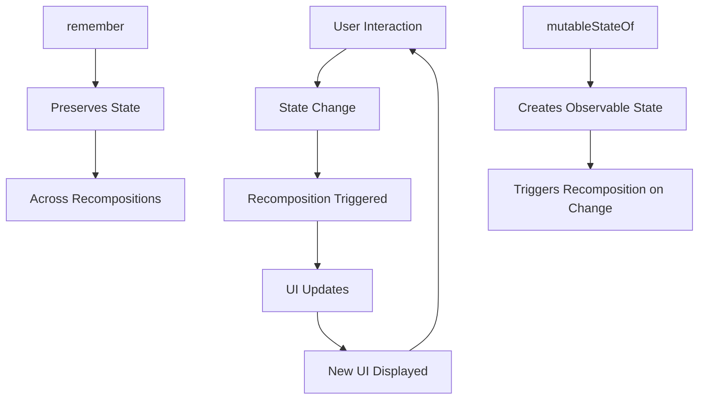

# 🔄 Jetpack Compose UI State - Complete Study Guide

## 🎯 What You'll Learn
- **State in Compose** - Making UI interactive
- **remember** - Preserving values across recompositions
- **mutableStateOf** - Creating reactive state
- **State hoisting** - Managing state properly
- **Real examples** - Counters, forms, toggles

---

## 🧠 Understanding State

### What is State?
**State** = Data that can change over time and affects what the UI shows

```kotlin
// Examples of UI State:
val isButtonPressed = true           // Boolean state
val userInput = "Hello World"        // String state  
val counter = 42                     // Number state
val selectedItems = listOf(1, 3, 5)  // List state
```

### The Problem: Recomposition
```kotlin
// ❌ This won't work - value resets every recomposition!
@Composable
fun BrokenCounter() {
    var count = 0  // Resets to 0 every time UI updates!
    
    Column {
        Text("Count: $count")
        Button(onClick = { 
            count++  // This increment is lost!
        }) {
            Text("Increment")
        }
    }
}
```

### The Solution: remember + mutableStateOf
```kotlin
// ✅ This works - state survives recompositions!
@Composable  
fun WorkingCounter() {
    var count by remember { mutableStateOf(0) }  // State persists!
    
    Column {
        Text("Count: $count")
        Button(onClick = { 
            count++  // This increment is remembered!
        }) {
            Text("Increment")
        }
    }
}
```

---

## 🔗 Basic State Examples

### Simple Counter App

```kotlin
package com.example.uistate

import android.os.Bundle
import androidx.activity.ComponentActivity
import androidx.activity.compose.setContent
import androidx.compose.foundation.layout.*
import androidx.compose.material3.*
import androidx.compose.runtime.*
import androidx.compose.ui.Alignment
import androidx.compose.ui.Modifier
import androidx.compose.ui.text.font.FontWeight
import androidx.compose.ui.tooling.preview.Preview
import androidx.compose.ui.unit.dp
import androidx.compose.ui.unit.sp

class CounterActivity : ComponentActivity() {
    override fun onCreate(savedInstanceState: Bundle?) {
        super.onCreate(savedInstanceState)
        setContent {
            MaterialTheme {
                Surface(
                    modifier = Modifier.fillMaxSize(),
                    color = MaterialTheme.colorScheme.background
                ) {
                    CounterScreen()
                }
            }
        }
    }
}

@Composable
fun CounterScreen() {
    // State that survives recompositions
    var count by remember { mutableStateOf(0) }
    
    Column(
        modifier = Modifier
            .fillMaxSize()
            .padding(32.dp),
        horizontalAlignment = Alignment.CenterHorizontally,
        verticalArrangement = Arrangement.Center
    ) {
        Text(
            text = "Counter App",
            fontSize = 28.sp,
            fontWeight = FontWeight.Bold
        )
        
        Spacer(modifier = Modifier.height(32.dp))
        
        Text(
            text = "$count",
            fontSize = 48.sp,
            fontWeight = FontWeight.Bold,
            color = MaterialTheme.colorScheme.primary
        )
        
        Spacer(modifier = Modifier.height(32.dp))
        
        Row(
            horizontalArrangement = Arrangement.spacedBy(16.dp)
        ) {
            Button(
                onClick = { count-- },
                enabled = count > 0
            ) {
                Text("- Decrease")
            }
            
            Button(onClick = { count++ }) {
                Text("+ Increase")
            }
        }
        
        Spacer(modifier = Modifier.height(16.dp))
        
        Button(
            onClick = { count = 0 },
            colors = ButtonDefaults.buttonColors(
                containerColor = MaterialTheme.colorScheme.error
            )
        ) {
            Text("Reset")
        }
    }
}

@Preview(showBackground = true)
@Composable
fun CounterPreview() {
    MaterialTheme {
        CounterScreen()
    }
}
```

### Text Input with State

```kotlin
package com.example.uistate

import android.os.Bundle
import androidx.activity.ComponentActivity
import androidx.activity.compose.setContent
import androidx.compose.foundation.layout.*
import androidx.compose.material3.*
import androidx.compose.runtime.*
import androidx.compose.ui.Alignment
import androidx.compose.ui.Modifier
import androidx.compose.ui.text.font.FontWeight
import androidx.compose.ui.tooling.preview.Preview
import androidx.compose.ui.unit.dp
import androidx.compose.ui.unit.sp

class TextInputActivity : ComponentActivity() {
    override fun onCreate(savedInstanceState: Bundle?) {
        super.onCreate(savedInstanceState)
        setContent {
            MaterialTheme {
                Surface(
                    modifier = Modifier.fillMaxSize(),
                    color = MaterialTheme.colorScheme.background
                ) {
                    TextInputExample()
                }
            }
        }
    }
}

@OptIn(ExperimentalMaterial3Api::class)
@Composable
fun TextInputExample() {
    // State for text input
    var textInput by remember { mutableStateOf("") }
    var displayText by remember { mutableStateOf("") }
    var characterCount by remember { mutableStateOf(0) }
    
    // Derived state - automatically calculated from other state
    val isEmpty = textInput.isEmpty()
    val isLongText = textInput.length > 20
    
    Column(
        modifier = Modifier
            .fillMaxSize()
            .padding(24.dp),
        horizontalAlignment = Alignment.CenterHorizontally,
        verticalArrangement = Arrangement.spacedBy(16.dp)
    ) {
        Text(
            text = "Text Input Demo",
            fontSize = 24.sp,
            fontWeight = FontWeight.Bold
        )
        
        OutlinedTextField(
            value = textInput,
            onValueChange = { newValue ->
                textInput = newValue
                characterCount = newValue.length
            },
            label = { Text("Enter your message") },
            placeholder = { Text("Type something...") },
            modifier = Modifier.fillMaxWidth(),
            supportingText = {
                Text("Characters: $characterCount")
            },
            isError = isLongText
        )
        
        Row(
            horizontalArrangement = Arrangement.spacedBy(12.dp)
        ) {
            Button(
                onClick = { 
                    displayText = textInput 
                },
                enabled = !isEmpty
            ) {
                Text("Show Text")
            }
            
            OutlinedButton(
                onClick = { 
                    textInput = ""
                    displayText = ""
                    characterCount = 0
                }
            ) {
                Text("Clear All")
            }
        }
        
        if (displayText.isNotEmpty()) {
            Card(
                modifier = Modifier.fillMaxWidth(),
                elevation = CardDefaults.cardElevation(defaultElevation = 4.dp)
            ) {
                Column(
                    modifier = Modifier.padding(16.dp)
                ) {
                    Text(
                        text = "Your Message:",
                        fontWeight = FontWeight.Bold
                    )
                    Spacer(modifier = Modifier.height(8.dp))
                    Text(
                        text = displayText,
                        fontSize = 16.sp
                    )
                }
            }
        }
        
        // Status indicators
        when {
            isEmpty -> Text("✍️ Start typing!", color = MaterialTheme.colorScheme.outline)
            isLongText -> Text("⚠️ Text is getting long!", color = MaterialTheme.colorScheme.error)
            else -> Text("✅ Looking good!", color = MaterialTheme.colorScheme.primary)
        }
    }
}

@Preview(showBackground = true)
@Composable
fun TextInputPreview() {
    MaterialTheme {
        TextInputExample()
    }
}
```

### Toggle States (Boolean State)

```kotlin
package com.example.uistate

import android.os.Bundle
import androidx.activity.ComponentActivity
import androidx.activity.compose.setContent
import androidx.compose.foundation.layout.*
import androidx.compose.material3.*
import androidx.compose.runtime.*
import androidx.compose.ui.Alignment
import androidx.compose.ui.Modifier
import androidx.compose.ui.text.font.FontWeight
import androidx.compose.ui.tooling.preview.Preview
import androidx.compose.ui.unit.dp
import androidx.compose.ui.unit.sp

class ToggleStatesActivity : ComponentActivity() {
    override fun onCreate(savedInstanceState: Bundle?) {
        super.onCreate(savedInstanceState)
        setContent {
            MaterialTheme {
                Surface(
                    modifier = Modifier.fillMaxSize(),
                    color = MaterialTheme.colorScheme.background
                ) {
                    ToggleStatesExample()
                }
            }
        }
    }
}

@Composable
fun ToggleStatesExample() {
    // Multiple boolean states
    var isDarkMode by remember { mutableStateOf(false) }
    var isNotificationsEnabled by remember { mutableStateOf(true) }
    var isLocationEnabled by remember { mutableStateOf(false) }
    var isWifiEnabled by remember { mutableStateOf(true) }
    
    Column(
        modifier = Modifier
            .fillMaxSize()
            .padding(24.dp),
        verticalArrangement = Arrangement.spacedBy(20.dp)
    ) {
        Text(
            text = "Settings",
            fontSize = 28.sp,
            fontWeight = FontWeight.Bold
        )
        
        // Dark Mode Toggle
        SettingToggle(
            title = "Dark Mode",
            description = "Use dark theme",
            isChecked = isDarkMode,
            onToggle = { isDarkMode = it }
        )
        
        // Notifications Toggle
        SettingToggle(
            title = "Notifications",
            description = "Receive push notifications",
            isChecked = isNotificationsEnabled,
            onToggle = { isNotificationsEnabled = it }
        )
        
        // Location Toggle
        SettingToggle(
            title = "Location Services",
            description = "Allow location access",
            isChecked = isLocationEnabled,
            onToggle = { isLocationEnabled = it }
        )
        
        // WiFi Toggle
        SettingToggle(
            title = "WiFi",
            description = "Connect to WiFi networks",
            isChecked = isWifiEnabled,
            onToggle = { isWifiEnabled = it }
        )
        
        Divider()
        
        // Status Summary
        Card(
            modifier = Modifier.fillMaxWidth(),
            colors = CardDefaults.cardColors(
                containerColor = MaterialTheme.colorScheme.primaryContainer
            )
        ) {
            Column(
                modifier = Modifier.padding(16.dp)
            ) {
                Text(
                    text = "Current Settings:",
                    fontWeight = FontWeight.Bold
                )
                Spacer(modifier = Modifier.height(8.dp))
                
                Text("🌙 Dark Mode: ${if (isDarkMode) "ON" else "OFF"}")
                Text("🔔 Notifications: ${if (isNotificationsEnabled) "ON" else "OFF"}")
                Text("📍 Location: ${if (isLocationEnabled) "ON" else "OFF"}")
                Text("📶 WiFi: ${if (isWifiEnabled) "ON" else "OFF"}")
            }
        }
    }
}

@Composable
fun SettingToggle(
    title: String,
    description: String,
    isChecked: Boolean,
    onToggle: (Boolean) -> Unit
) {
    Row(
        modifier = Modifier.fillMaxWidth(),
        verticalAlignment = Alignment.CenterVertically
    ) {
        Column(
            modifier = Modifier.weight(1f)
        ) {
            Text(
                text = title,
                fontSize = 16.sp,
                fontWeight = FontWeight.Medium
            )
            Text(
                text = description,
                fontSize = 14.sp,
                color = MaterialTheme.colorScheme.onSurfaceVariant
            )
        }
        
        Switch(
            checked = isChecked,
            onCheckedChange = onToggle
        )
    }
}

@Preview(showBackground = true)
@Composable
fun ToggleStatesPreview() {
    MaterialTheme {
        ToggleStatesExample()
    }
}
```

---

## 📋 List State Management

### Dynamic List with Add/Remove

```kotlin
package com.example.uistate

import android.os.Bundle
import androidx.activity.ComponentActivity
import androidx.activity.compose.setContent
import androidx.compose.foundation.layout.*
import androidx.compose.foundation.lazy.LazyColumn
import androidx.compose.foundation.lazy.items
import androidx.compose.material.icons.Icons
import androidx.compose.material.icons.filled.Add
import androidx.compose.material.icons.filled.Delete
import androidx.compose.material3.*
import androidx.compose.runtime.*
import androidx.compose.ui.Alignment
import androidx.compose.ui.Modifier
import androidx.compose.ui.text.font.FontWeight
import androidx.compose.ui.tooling.preview.Preview
import androidx.compose.ui.unit.dp
import androidx.compose.ui.unit.sp

data class TodoItem(
    val id: Int,
    val text: String,
    val isCompleted: Boolean = false
)

class TodoListActivity : ComponentActivity() {
    override fun onCreate(savedInstanceState: Bundle?) {
        super.onCreate(savedInstanceState)
        setContent {
            MaterialTheme {
                Surface(
                    modifier = Modifier.fillMaxSize(),
                    color = MaterialTheme.colorScheme.background
                ) {
                    TodoListExample()
                }
            }
        }
    }
}

@OptIn(ExperimentalMaterial3Api::class)
@Composable
fun TodoListExample() {
    // State for the list of todos
    var todoList by remember { 
        mutableStateOf(
            listOf(
                TodoItem(1, "Buy groceries"),
                TodoItem(2, "Walk the dog", true),
                TodoItem(3, "Finish homework")
            )
        ) 
    }
    
    // State for adding new items
    var newTodoText by remember { mutableStateOf("") }
    var nextId by remember { mutableStateOf(4) }
    
    // Derived states
    val completedCount = todoList.count { it.isCompleted }
    val totalCount = todoList.size
    
    Column(
        modifier = Modifier
            .fillMaxSize()
            .padding(16.dp)
    ) {
        // Header
        Text(
            text = "Todo List",
            fontSize = 24.sp,
            fontWeight = FontWeight.Bold
        )
        
        Text(
            text = "Completed: $completedCount/$totalCount",
            fontSize = 14.sp,
            color = MaterialTheme.colorScheme.onSurfaceVariant,
            modifier = Modifier.padding(bottom = 16.dp)
        )
        
        // Add new todo section
        Row(
            modifier = Modifier.fillMaxWidth(),
            verticalAlignment = Alignment.CenterVertically
        ) {
            OutlinedTextField(
                value = newTodoText,
                onValueChange = { newTodoText = it },
                label = { Text("New todo") },
                modifier = Modifier.weight(1f)
            )
            
            Spacer(modifier = Modifier.width(8.dp))
            
            FloatingActionButton(
                onClick = {
                    if (newTodoText.isNotBlank()) {
                        todoList = todoList + TodoItem(nextId, newTodoText.trim())
                        nextId++
                        newTodoText = ""
                    }
                },
                modifier = Modifier.size(48.dp)
            ) {
                Icon(Icons.Default.Add, contentDescription = "Add todo")
            }
        }
        
        Spacer(modifier = Modifier.height(16.dp))
        
        // Todo list
        LazyColumn(
            verticalArrangement = Arrangement.spacedBy(8.dp)
        ) {
            items(
                items = todoList,
                key = { it.id }
            ) { todo ->
                TodoItemCard(
                    todo = todo,
                    onToggleComplete = { 
                        todoList = todoList.map {
                            if (it.id == todo.id) {
                                it.copy(isCompleted = !it.isCompleted)
                            } else it
                        }
                    },
                    onDelete = {
                        todoList = todoList.filter { it.id != todo.id }
                    }
                )
            }
        }
        
        if (todoList.isEmpty()) {
            Box(
                modifier = Modifier.fillMaxSize(),
                contentAlignment = Alignment.Center
            ) {
                Text(
                    text = "No todos yet! Add one above.",
                    color = MaterialTheme.colorScheme.onSurfaceVariant
                )
            }
        }
    }
}

@Composable
fun TodoItemCard(
    todo: TodoItem,
    onToggleComplete: () -> Unit,
    onDelete: () -> Unit
) {
    Card(
        modifier = Modifier.fillMaxWidth(),
        colors = CardDefaults.cardColors(
            containerColor = if (todo.isCompleted) 
                MaterialTheme.colorScheme.surfaceVariant 
            else MaterialTheme.colorScheme.surface
        )
    ) {
        Row(
            modifier = Modifier.padding(16.dp),
            verticalAlignment = Alignment.CenterVertically
        ) {
            Checkbox(
                checked = todo.isCompleted,
                onCheckedChange = { onToggleComplete() }
            )
            
            Spacer(modifier = Modifier.width(12.dp))
            
            Text(
                text = todo.text,
                modifier = Modifier.weight(1f),
                style = if (todo.isCompleted) {
                    MaterialTheme.typography.bodyMedium.copy(
                        color = MaterialTheme.colorScheme.onSurfaceVariant
                    )
                } else {
                    MaterialTheme.typography.bodyMedium
                }
            )
            
            IconButton(onClick = onDelete) {
                Icon(
                    Icons.Default.Delete,
                    contentDescription = "Delete todo",
                    tint = MaterialTheme.colorScheme.error
                )
            }
        }
    }
}

@Preview(showBackground = true)
@Composable
fun TodoListPreview() {
    MaterialTheme {
        TodoListExample()
    }
}
```

---

## 🏗️ State Hoisting Pattern

### What is State Hoisting?
**Moving state up to a common parent** so multiple composables can share and modify it.

```kotlin
package com.example.uistate

import android.os.Bundle
import androidx.activity.ComponentActivity
import androidx.activity.compose.setContent
import androidx.compose.foundation.layout.*
import androidx.compose.material3.*
import androidx.compose.runtime.*
import androidx.compose.ui.Alignment
import androidx.compose.ui.Modifier
import androidx.compose.ui.text.font.FontWeight
import androidx.compose.ui.tooling.preview.Preview
import androidx.compose.ui.unit.dp
import androidx.compose.ui.unit.sp

class StateHoistingActivity : ComponentActivity() {
    override fun onCreate(savedInstanceState: Bundle?) {
        super.onCreate(savedInstanceState)
        setContent {
            MaterialTheme {
                Surface(
                    modifier = Modifier.fillMaxSize(),
                    color = MaterialTheme.colorScheme.background
                ) {
                    StateHoistingExample()
                }
            }
        }
    }
}

@Composable
fun StateHoistingExample() {
    // ✅ State hoisted to parent - can be shared by multiple children
    var sharedCounter by remember { mutableStateOf(0) }
    var userName by remember { mutableStateOf("") }
    
    Column(
        modifier = Modifier
            .fillMaxSize()
            .padding(24.dp),
        horizontalAlignment = Alignment.CenterHorizontally,
        verticalArrangement = Arrangement.spacedBy(24.dp)
    ) {
        Text(
            text = "State Hoisting Demo",
            fontSize = 24.sp,
            fontWeight = FontWeight.Bold
        )
        
        // Pass state down to children
        UserNameInput(
            name = userName,
            onNameChange = { userName = it }
        )
        
        CounterSection(
            count = sharedCounter,
            onCountChange = { sharedCounter = it }
        )
        
        // Another component using the same state
        StatusDisplay(
            userName = userName,
            counter = sharedCounter
        )
    }
}

@OptIn(ExperimentalMaterial3Api::class)
@Composable
fun UserNameInput(
    name: String,           // State passed from parent
    onNameChange: (String) -> Unit  // Callback to update parent state
) {
    Card(
        modifier = Modifier.fillMaxWidth()
    ) {
        Column(
            modifier = Modifier.padding(16.dp)
        ) {
            Text(
                text = "User Info",
                fontWeight = FontWeight.Bold
            )
            Spacer(modifier = Modifier.height(8.dp))
            
            OutlinedTextField(
                value = name,
                onValueChange = onNameChange,  // Notify parent of changes
                label = { Text("Your name") },
                modifier = Modifier.fillMaxWidth()
            )
        }
    }
}

@Composable
fun CounterSection(
    count: Int,                    // State from parent
    onCountChange: (Int) -> Unit   // Callback to update parent
) {
    Card(
        modifier = Modifier.fillMaxWidth()
    ) {
        Column(
            modifier = Modifier.padding(16.dp),
            horizontalAlignment = Alignment.CenterHorizontally
        ) {
            Text(
                text = "Shared Counter",
                fontWeight = FontWeight.Bold
            )
            
            Spacer(modifier = Modifier.height(8.dp))
            
            Text(
                text = "$count",
                fontSize = 32.sp,
                color = MaterialTheme.colorScheme.primary
            )
            
            Spacer(modifier = Modifier.height(8.dp))
            
            Row(
                horizontalArrangement = Arrangement.spacedBy(12.dp)
            ) {
                Button(onClick = { onCountChange(count - 1) }) {
                    Text("-")
                }
                Button(onClick = { onCountChange(count + 1) }) {
                    Text("+")
                }
            }
        }
    }
}

@Composable
fun StatusDisplay(
    userName: String,
    counter: Int
) {
    Card(
        modifier = Modifier.fillMaxWidth(),
        colors = CardDefaults.cardColors(
            containerColor = MaterialTheme.colorScheme.primaryContainer
        )
    ) {
        Column(
            modifier = Modifier.padding(16.dp)
        ) {
            Text(
                text = "Status",
                fontWeight = FontWeight.Bold
            )
            Spacer(modifier = Modifier.height(8.dp))
            
            when {
                userName.isEmpty() -> Text("👋 Please enter your name")
                counter == 0 -> Text("Hello $userName! Try clicking the counter buttons.")
                counter > 0 -> Text("Great job $userName! You've clicked $counter times.")
                else -> Text("$userName, negative numbers? Interesting choice!")
            }
        }
    }
}

@Preview(showBackground = true)
@Composable
fun StateHoistingPreview() {
    MaterialTheme {
        StateHoistingExample()
    }
}
```

---

## ⚡ State Best Practices

### 1. Use Derived State
```kotlin
@Composable
fun BestPracticesExample() {
    var userInput by remember { mutableStateOf("") }
    
    // ✅ Derived state - automatically calculated
    val isEmpty = userInput.isEmpty()
    val wordCount = userInput.split(" ").count { it.isNotBlank() }
    val isValid = userInput.length >= 3
    
    // Use derived states instead of separate state variables
}
```

### 2. Key for Performance
```kotlin
LazyColumn {
    items(
        items = itemList,
        key = { item -> item.id }  // ✅ Always use unique keys
    ) { item ->
        ItemCard(item)
    }
}
```

### 3. State Structure
```kotlin
// ✅ Good - Simple, flat state
var name by remember { mutableStateOf("") }
var age by remember { mutableStateOf(0) }

// ✅ Better for complex state - Single data class
data class UserForm(val name: String = "", val age: Int = 0)
var userForm by remember { mutableStateOf(UserForm()) }
```

---

## 🔄 State Flow Diagram



---

## ❓ Quick FAQs

### Q: What's the difference between `var` and `remember`?
**A:** `var` resets on every recomposition. `remember` preserves the value across recompositions.

### Q: When do I need `by` in `var count by remember`?
**A:** `by` is a delegate that makes the syntax cleaner. You can also use:
```kotlin
val count = remember { mutableStateOf(0) }
// Then access with count.value
```

### Q: What triggers recomposition?
**A:** When any state that the composable reads changes, it recomposes automatically.

### Q: Should I hoist all state up?
**A:** Only hoist state that needs to be shared. Keep local state local for better performance.

### Q: Can I use regular variables for state?
**A:** No! Regular variables reset on recomposition. Always use `remember { mutableStateOf() }`.

---

## 🎯 Practice Exercises

### Exercise 1: Login Form
Create a login form with validation state:
- Username and password fields
- "Login" button enabled only when both fields have text
- Show validation messages

### Exercise 2: Shopping Cart
Build a simple cart with:
- List of products with "Add to Cart" buttons  
- Cart counter that shows total items
- Remove items functionality

### Exercise 3: Tab Navigation
Create a tab interface:
- 3 tabs: Home, Profile, Settings
- Track which tab is selected
- Show different content based on selected tab

---

## 🔧 Key Syntax Reference

| Pattern | Syntax | Use Case |
|---------|--------|----------|
| Basic State | `var x by remember { mutableStateOf(0) }` | Numbers, strings, booleans |
| List State | `var list by remember { mutableStateOf(listOf()) }` | Dynamic lists |
| Data Class State | `var user by remember { mutableStateOf(User()) }` | Complex objects |
| Derived State | `val isEmpty = text.isEmpty()` | Calculated values |

## 📚 Next Topic Preview
**Coming up: Input Controls** - TextField, Checkbox, RadioButton, and more interactive components!

---

**🎯 Remember: State = Data that changes over time and affects your UI!**
