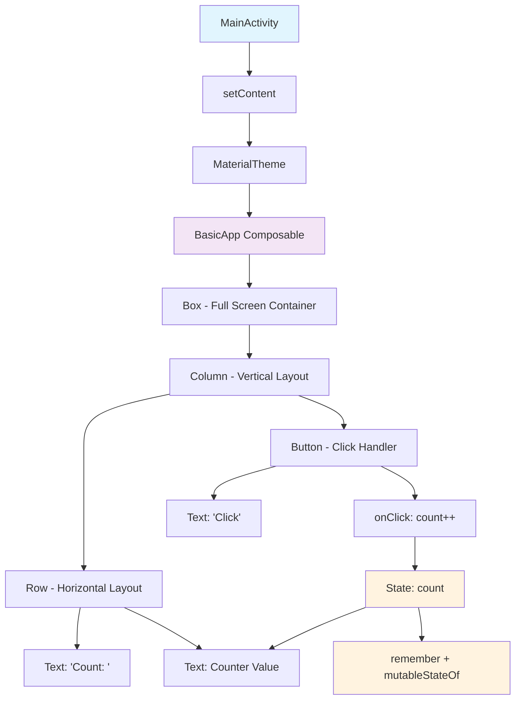

# Jetpack Compose Basic App Guide

## Overview
This guide demonstrates a minimal Jetpack Compose app using the core UI components: Box, Column, Row, Text, and Button. The app creates a simple counter that users can increment by tapping a button.

## Complete Code

```kotlin
package com.example.basicapp

import android.os.Bundle
import androidx.activity.ComponentActivity
import androidx.activity.compose.setContent
import androidx.compose.foundation.layout.*
import androidx.compose.material3.*
import androidx.compose.runtime.*
import androidx.compose.ui.Alignment
import androidx.compose.ui.Modifier
import androidx.compose.ui.tooling.preview.Preview
import androidx.compose.ui.unit.dp

class MainActivity : ComponentActivity() {
    override fun onCreate(savedInstanceState: Bundle?) {
        super.onCreate(savedInstanceState)
        setContent {
            MaterialTheme {
                BasicApp()
            }
        }
    }
}

@Composable
fun BasicApp() {
    var count by remember { mutableStateOf(0) }
    
    Box(
        modifier = Modifier.fillMaxSize(),
        contentAlignment = Alignment.Center
    ) {
        Column {
            Row {
                Text("Count: ")
                Text("$count")
            }
            Button(
                onClick = { count++ },
                modifier = Modifier.padding(top = 8.dp)
            ) {
                Text("Click")
            }
        }
    }
}

@Preview(showBackground = true)
@Composable
fun BasicAppPreview() {
    MaterialTheme {
        BasicApp()
    }
}
```

## Component Breakdown

### Required Imports
- `androidx.activity.ComponentActivity` - Base activity for Compose
- `androidx.activity.compose.setContent` - Sets Compose content
- `androidx.compose.foundation.layout.*` - Layout components (Box, Column, Row)
- `androidx.compose.material3.*` - Material Design 3 components
- `androidx.compose.runtime.*` - State management (remember, mutableStateOf)
- `androidx.compose.ui.Alignment` - Alignment constants
- `androidx.compose.ui.Modifier` - UI modifiers
- `androidx.compose.ui.tooling.preview.Preview` - Preview annotation
- `androidx.compose.ui.unit.dp` - Density-independent pixels

### Component Usage

**Box**: Acts as a container that centers its content within the full screen size
```kotlin
Box(
    modifier = Modifier.fillMaxSize(),
    contentAlignment = Alignment.Center
)
```

**Column**: Arranges child components vertically (Row with count, Button)
```kotlin
Column {
    // Children arranged vertically
}
```

**Row**: Arranges the "Count:" label and number horizontally
```kotlin
Row {
    Text("Count: ")
    Text("$count")
}
```

**Text**: Displays static text and dynamic counter value
```kotlin
Text("Count: ")  // Static label
Text("$count")   // Dynamic value
```

**Button**: Clickable component that increments the counter
```kotlin
Button(onClick = { count++ }) {
    Text("Click")
}
```

## State Management
The app uses `remember` and `mutableStateOf` for state management:
- `var count by remember { mutableStateOf(0) }` creates a reactive state variable
- When `count` changes, the UI automatically recomposes to reflect the new value

## Preview Function
The `@Preview` annotation allows you to see the UI in Android Studio's design panel without running the app:
```kotlin
@Preview(showBackground = true)
@Composable
fun BasicAppPreview() {
    MaterialTheme {
        BasicApp()
    }
}
```

## App Architecture Diagram



## Key Concepts

1. **Declarative UI**: Compose uses a declarative approach where you describe what the UI should look like based on the current state

2. **Recomposition**: When state changes, Compose automatically updates only the parts of the UI that need to change

3. **Modifiers**: Used to modify the appearance and behavior of composables (e.g., `Modifier.fillMaxSize()`, `Modifier.padding()`)

4. **State Hoisting**: State is managed at the appropriate level and passed down to child composables

This minimal example demonstrates the fundamental building blocks of Jetpack Compose applications.
