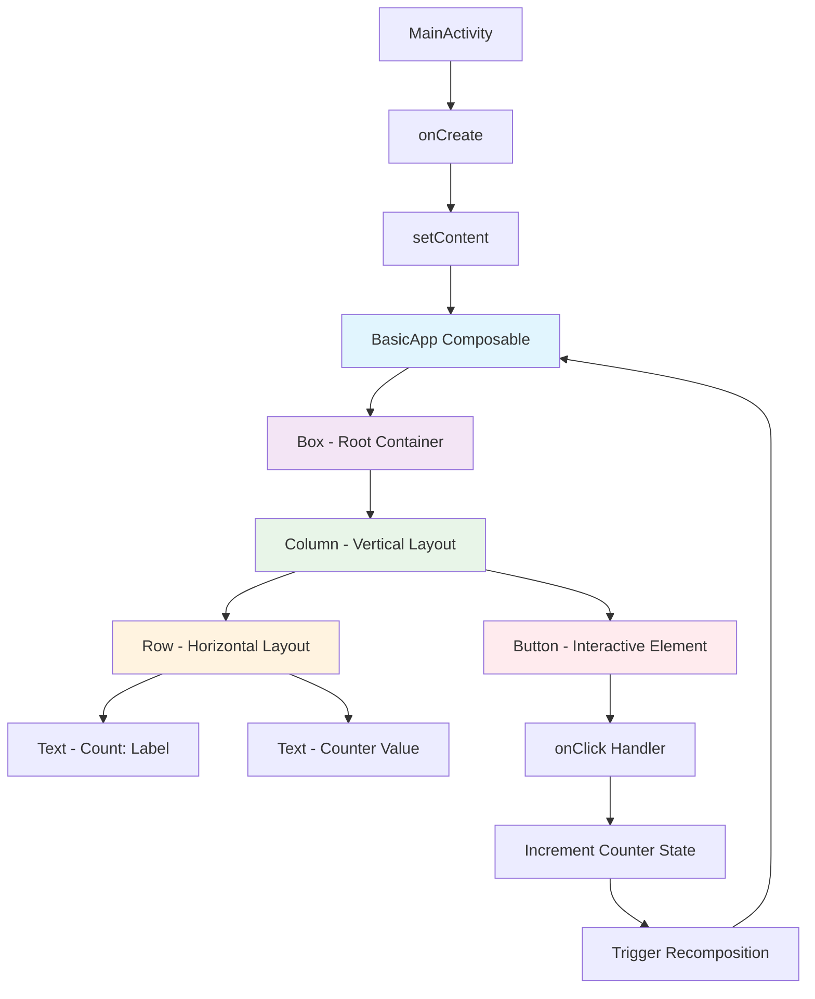

# Basic Jetpack Compose App Documentation

## Overview
This is a minimal Android app built using Jetpack Compose that demonstrates the fundamental layout components and state management. The app implements a simple counter that users can increment by tapping a button.

## Components Used

### Layout Components
- **Box** - Root container that centers all content on the screen
- **Column** - Vertical layout container that stacks the counter display and button
- **Row** - Horizontal layout container that places the "Count:" label and number side by side

### UI Components
- **Text** - Displays static text ("Count:") and dynamic text (counter value)
- **Button** - Interactive element that triggers the counter increment

## State Management
The app uses `remember` and `mutableStateOf` to maintain the counter state across recompositions. When the button is clicked, the counter increments and the UI automatically updates.

## Key Features
- Centered layout using Box with `Alignment.Center`
- State-driven UI that recomposes when counter changes
- Clean separation of display (Row with two Text components) and interaction (Button)
- Minimal padding for visual spacing

## App Structure

## Code Flow
1. **MainActivity** sets up the Compose UI in `onCreate()`
2. **BasicApp** composable manages the counter state using `remember`
3. **Layout hierarchy** creates a centered, organized display
4. **User interaction** triggers state changes that automatically update the UI
